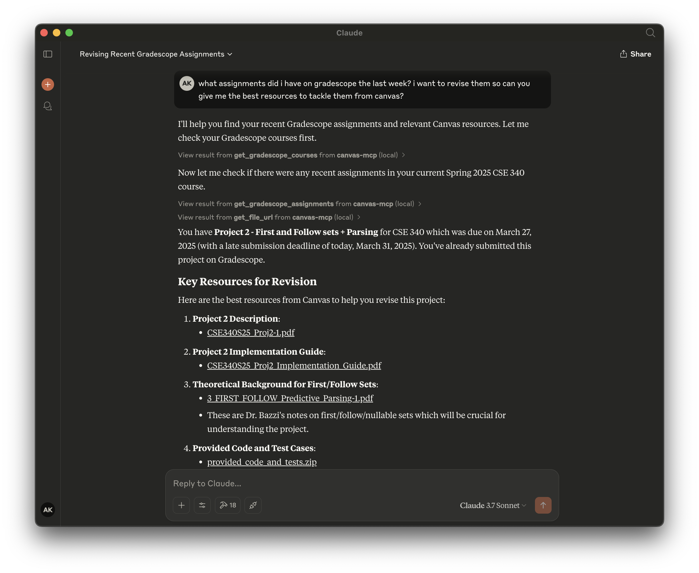

# Canvas MCP

[](https://smithery.ai/server/@aryankeluskar/canvas-mcp)

Canvas MCP is a set of tools that allows your AI agents to interact with Canvas LMS and Gradescope.




## Features

- **Find relevant resources** - Ability to find relevant resources for a given query in natural language!
- **Query upcoming assignments** - Not only fetch upcoming assignments, but also provide its breakdown for a given course.
- **Get courses and assignments from Gradescope** - Query your Gradescope courses and assignments with natural language, get submission status, and more!
- Get courses
- Get modules
- Get module items
- Get file url
- Get calendar events
- Get assignments
- and so much more... 

## Usage

Note down the following beforehand:
1. Canvas API Key from `Canvas > Account > Settings > Approved Integrations > New Access Token`
2. Gradescope Email and Password https://www.gradescope.com/
   
### Installing via Smithery (**Preferred**)

To install Canvas MCP for Claude Desktop automatically via [Smithery](https://smithery.ai/server/@aryankeluskar/canvas-mcp):

```bash
npx -y @smithery/cli install @aryankeluskar/canvas-mcp --client claude
```

Or, for Cursor IDE to use canvas-mcp with other models:

```bash
npx -y @smithery/cli install @aryankeluskar/canvas-mcp --client cursor
```

Or, for Windsurf:

```bash
npx -y @smithery/cli install @aryankeluskar/canvas-mcp --client windsurf
```

---


### Manual Installation (ONLY for local instances)

TODO

### Manual Configuration

Create a `.env` file in the root directory with the following environment variables:

```
SNITHERY_API_KEY=your_snithery_api_key
```

Add the following to your `mcp.json` or `claude_desktop_config.json` file:

```json
{
  "mcpServers": {
      "canvas": {
          "command": "npx",
          "args": [
              "-y",
              "@smithery/cli",
              "run",
              "@aryankeluskar/canvas-mcp"
          ]
      }
  }
}
```

---

Built by [Aryan Keluskar](https://aryankeluskar.com) :)
